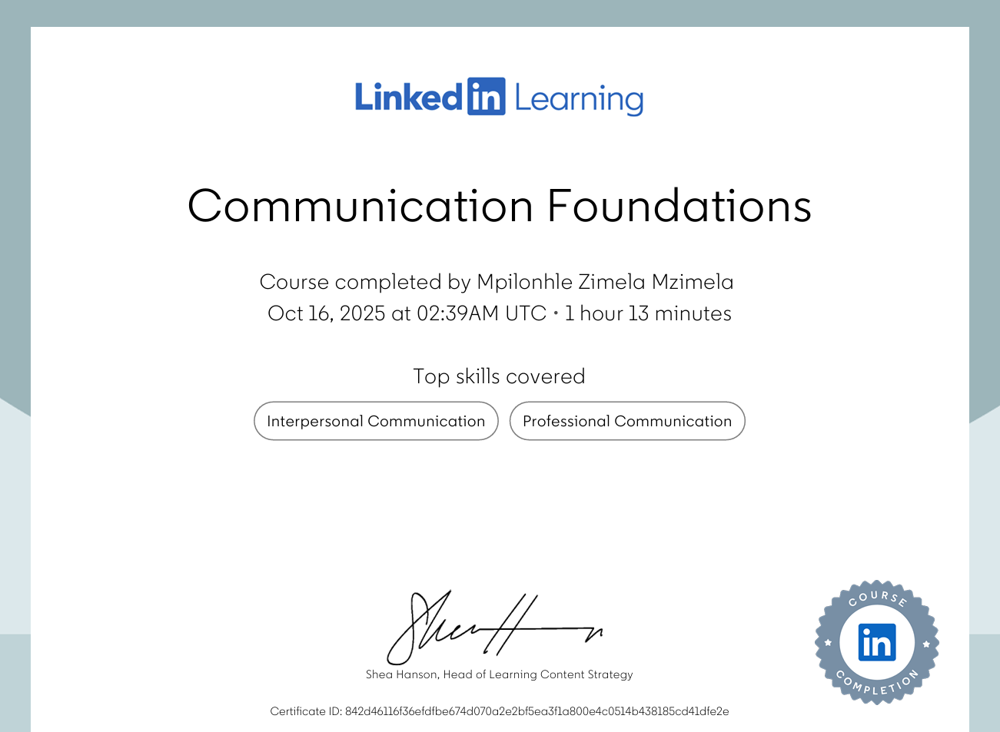
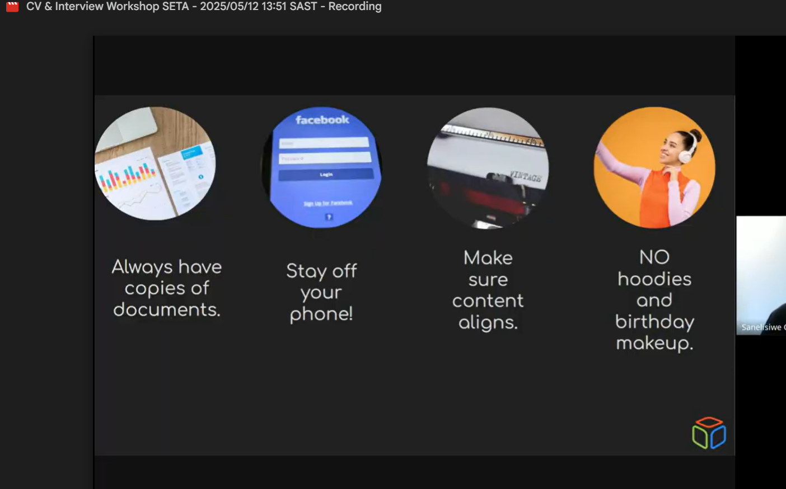
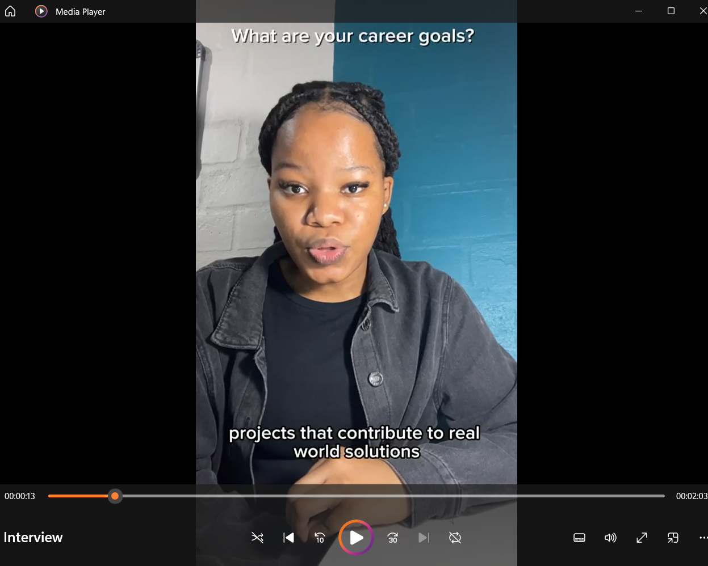
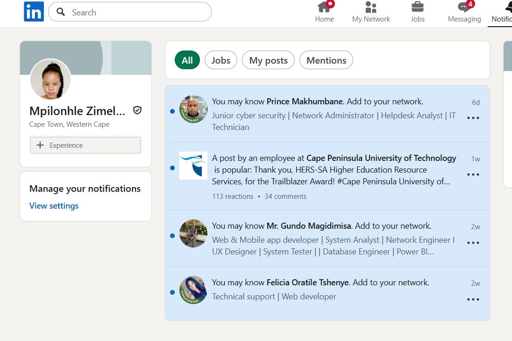
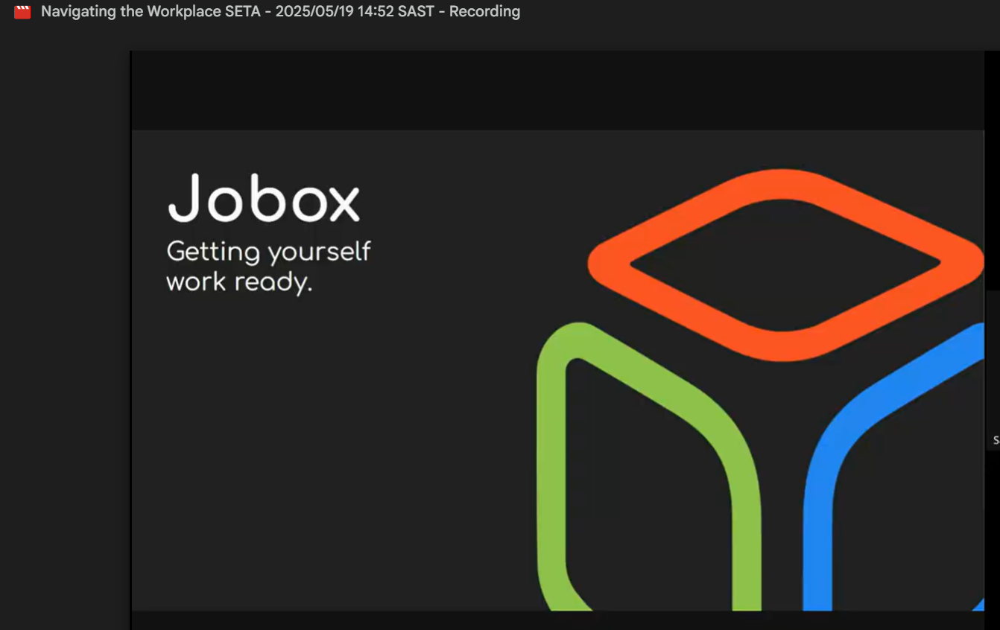

# WorkReadinessPortfolio

# Work Readiness Digital Portfolio (FSA)  
**Student:** Mpilonhle Mzimela  
**Programme:** Diploma in ICT: Applications Development (CPUT)  
**Email:** 230197833@mycput.ac.za  

1️⃣ Business Communication

### Evidence

### ✨ Reflection (STAR)

**S – Situation:**
As part of my work preparation journey, I enrolled in a LinkedIn Learning course on **Business Communication** to improve my competency in communicating effectively within workplaces. I learned that technical skills alone are not enough in the ICT industry — the skill of conveying ideas clearly to managers, clients, and colleagues is just as essential.

**T – Task:**
My goal was to understand the primary principles of respectful, clear, and professional communication. The course sensitized me to how tone, organization, and purpose impact professional communication and how to communicate effectively through emails, meetings, and project discussions.

**A – Action:**
I completed each module of the course, such as active listening, precise writing, body language, and presentation. I practiced rewriting in-house communications to formal email format, and I applied the lessons to make my communication clearer in university group projects. I observed how tone affects interpretation, especially with written words, and began using a more formal format for emails (description, content, and brief conclusion).

**R – Result:**
I speak more confidently and professionally now. I have learned to adapt my message to my audience — whether I'm explaining an idea to classmates or reporting on progress to a lecturer or employer. This has improved collaboration and reduced miscommunications within my group work. The LinkedIn course showed me valuable lessons about tone, clarity, and respect in the workplace that I will carry forward for the remainder of my career.

---

# 2️⃣ Interview Skills

### Evidence

### ✨ Reflection (STAR)

**S – Situation:**
I attended an **Interview Skills Workshop** which was conducted under the work readiness program. The purpose was to equip students like me with real interview experience through learning to project ourselves professionally, responding to challenging questions, and building confidence.

**T – Task:**
My task was to learn the skill of how to word my responses to interview questions and how to employ techniques like the **STAR method** when responding to questions on behaviour or scenarios. I also needed to exercise non-verbal communication — such as body positioning, posture, and eye contact — that need to be observed during an interview.

**A – Action:**
During the workshop, I engaged in group discussion and recorded common mistakes candidates make. I practiced answering questions like "Tell me about yourself" and "Tell me about a time when you overcame a difficulty" using the STAR method. I practiced maintaining eye contact and speaking clearly while controlling my nerves. Focusing answers on the job description was emphasized by the facilitator, which I enforced by connecting my responses to software development and application design positions.

**R – Result:**
The workshop increased my interview confidence and taught me how to market my experience and skills. I can now clearly explain my technical skills and present problem-solving and teamwork evidence. The exercise also improved my thinking speed and idea organization within a tight time frame — critical abilities for an IT interview.

---

# 3️⃣ Mock Interview

###  Evidence

### ✨ Reflection (STAR)

**S – Situation:**
To exercise my interview skills, I went for a **mock interview**, which was video recorded to provide feedback. The session replicated real interview conditions and had technical and behavioural questions related to software development and teamwork. 

**T – Task:**
The test was to convey professionalism and confidence during the interview and put into practice all the skills learned from the previous training. I had to answer questions regarding experience, technical projects, and future intentions with positive body language and attitude.

**A – Action:**
Beforehand, I practiced regular technical and behaviour questions. I rehearsed my answers in STAR format and rehearsed my body posture and voice projection. During the interview, I attempted to remain calm and clear-headed. I explained my group projects — such as QR Code Attendance System — briefly and goal-oriented. After the practice interview, I listened to the recording to assess my performance and identified areas of improvement, such as pacing and giving more examples in my answers.

**R – Result:**
The interview simulation experience was invaluable. Watching the video helped me see how I come across to interviewers and identify small mannerisms to work on (e.g., reducing filler words and pacing myself). I am more ready for real-life interviews now as I can manage nervousness and convey myself better. The exercise made me more aware of myself and enhanced my preparedness to interact confidently with employers.

---

# 4️⃣ Professional Networking

###  Evidence

### ✨ Reflection (STAR)

**S – Situation:**
Networking is very important in the ICT industry, where job opportunities usually come through professional connections and social media visibility. I created and fine-tuned my **LinkedIn profile** to develop my network, with links to classmates, lecturers, and industry professionals.

**T – Task:**
My task was to build a professional web presence and participate actively with people in the tech community. I aimed to build relationships potentially leading to mentorship, partnerships, or future employment.

**A – Action:**
I added a professional image to my profile, posted a descriptive headline ("ICT Student | Application Development | Java | Flutter | Firebase"), and added my education, projects, and skills. I enjoyed the pages of tech pages and companies such as Cisco, Google Developers, and CPUT's career services. I also added friends and commented on posts that had my areas of interest, such as app development and career development. Doing this, I began having brief professional conversations.

**R – Result:**
My LinkedIn profile is currently aligned with my career goals and capabilities. I have broadened my connections and discovered the latest trends and job opportunities in the industry. I also no longer hesitate to approach professionals for advice and potential internship opportunities. I learned from this experience that hard work in online engagement and professionalism will contribute to a successful ICT career development.

--- 

# 5️⃣ Workplace Etiquette

### Evidence

### ✨ Reflection (STAR)

**S – Situation:**
I attended a **Workplace Etiquette Workshop** facilitated by **Jobox** that dealt with professional etiquette, time management, team working, and adapting to company culture. The workshop was facilitated to assist students in making a successful transition into the corporate world.

**T – Task:**
My purpose was to become well-acquainted with expected company behavior at work and how to conduct oneself as an ICT intern or junior staff member. This included communication, attire, punctuality, and accepting diversity in the workplace.

**A – Action:**
The workshop had practical applications, such as solving conflicts professionally, being proactive, and respecting hierarchy and team work. I interacted with others while discussing and considered applying the lessons in my own workplace life in the future. I also compared what I learned to my previous volunteer experience in my family business where professionalism and reliability were given priority.

**R – Result:**
I now understand how apparently minor aspects — like greeting colleagues with respect, meeting deadlines, and taking ownership — create a good work environment. The Jobox workshop opened my eyes to the fact that professionalism is not technical expertise, but attitude, respect, and consistency. I will take these lessons with me when I begin my internship or permanent job.

---

# 🧾 References

- LinkedIn Learning. (2025). *Business Communication Foundations*. Available at: https://www.linkedin.com/learning .  
- CPUT Career Services. (2025). *Interview and Work Readiness Workshop Materials*.  
- Jobox. (2025). *Workplace Etiquette Workshop*. Available at: https://www.jobox.co.za.  
- LinkedIn. (2025). *Professional Networking for Students*. Available at: https://www.linkedin.com .  

---

